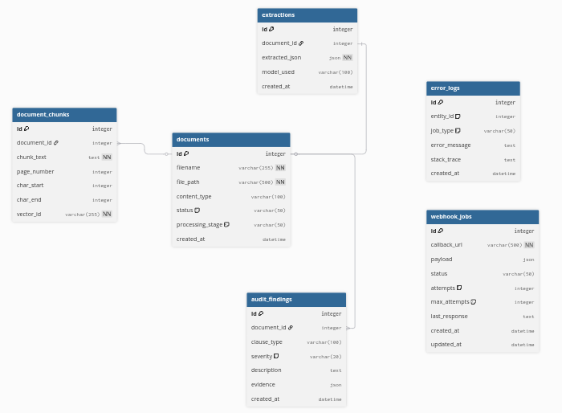

# **Design Document: Contract Intelligence System**

## **ARCHITECTURE & DATA MODEL**

### **1\. System Architecture**

The system is built as a **Multi-Stage Asynchronous Pipeline** using FastAPI.

* **Asynchronous Orchestration:** Uses FastAPI BackgroundTasks for non-blocking I/O. The system returns an accept status immediately, allowing for high throughput while processing takes place in the background.  
* **Pipeline Integrity:** The pipeline is "Stage-Gated." Sequential logic ensures that Phase 3 (Indexing) only begins if Phase 2 (AI Extraction) succeeds, preventing data corruption in the vector store.

### **2\. ER Diagram**

### 

### 

### **3\. Chunking & RAG Rationale**

* **Strategy:** Sliding Window Chunking (512 tokens with 50-token overlap).  
* **Rationale:** Standard fixed chunking breaks legal clauses. Overlapping ensures that semantic context (e.g., the subject of a "shall" clause) is preserved across boundary lines.  
* **Citations:** Every chunk is tagged with its page\_number from the original PDF, enabling the system to provide "Page X" citations during Q\&A.

---

## **LOGIC, RELIABILITY & SECURITY**

### **4\. AI Orchestration & Fallback Behavior**

The **🧠 LLM Layer** handles the volatility of cloud AI with production-grade resiliency.

* **Resiliency:** Implements **Exponential Backoff** using tenacity. It automatically retries on transient errors (Quota/503/Timeout) while failing immediately on 400-level errors to prevent token waste.  
* **Robust Parsing:** The parse\_json\_garbage utility uses re.DOTALL to extract JSON from conversational LLM responses, ensuring valid data even if the model ignores markdown formatting.  
* **Smart Truncation:** To stay within context windows and reduce latency, the system uses a **Head-Tail Focus** (First 25k and last 15k characters), preserving critical metadata and signatures while discarding middle "boilerplate" text.

### **5\. Hybrid Audit Strategy**

To balance cost and intelligence, the audit service employs two layers:

1. **Heuristic (Regex):** Instant, zero-cost keyword detection for standard risks (Indemnity, Liability).  
2. **Semantic (AI):** Deep reasoning that evaluates *meaning*. It doesn't just flag a "Liability Cap"; it evaluates if the cap is dangerously low relative to the contract value.

### **6\. Reliability & Webhooks**

* **Webhook Persistence:** Every notification is a WebhookJob. If a callback URL is down, the system logs the attempt and the response, allowing for manual re-triggering.  
* **State-Aware Recovery:** Because the database tracks the processing\_stage, a manual retry doesn't re-run the entire pipeline. It resumes from the point of failure (e.g., re-running AI extraction if Docling text extraction already succeeded).

### **7\. Security & Privacy Notes**

* **PII Masking:** A dedicated mask\_pii utility redacts Emails, SSNs, Credit Cards, and Addresses before they are committed to Error\_Logs or displayed in the CLI.  
* **Data Isolation:** Files are stored on disk with UUID-prefixed filenames to prevent directory traversal attacks or filename collisions.  
* **Deterministic Output:** temperature=0 is enforced across all AI calls to ensure consistency in legal entity extraction.

---